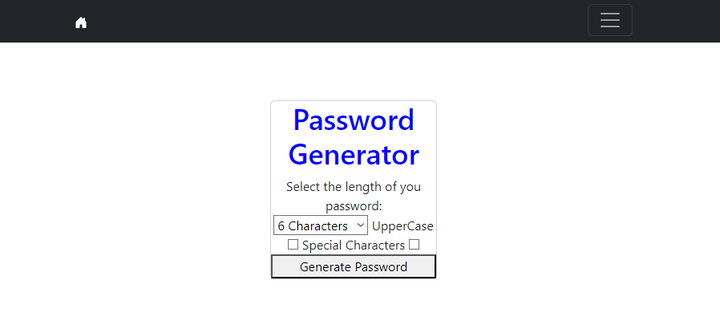

# Password generator


## 🐍 Summary 🐍

password generator with python

Features:

- ✅ Minimal and Simple styling
- ✅ virtualization

## 👻 Project Structure

Inside your Python project, you will see the following folders and files:

```
├── Ejemplo_uno/
├── generator/
│   ├── migrations/
│   └── templates/
├── README.md
└── manage.py
```

## ⚗️ Commands

All commands are run from the root of the project, from a terminal:

| Command                      | Action                                                            |
| :--------------------------  | :---------------------------------------------------------------- |
| `python -m virtualenv venv`  | virtualize first before installing other requirements dependencies|
| `.\venv\Scripts\activate`    | With this route you can activate virtualization                   |
| `pip install Django`         | This a requirements for run the project                           |
| `python manage.py runserver` | Starts local dev server at `localhost:8000`                       |

## Author

Roberth Zambrano ([@☆*: .｡. o(≧▽≦)o .｡.:*☆](https://github.com/juniorDeveloper8/juniorDeveloper8))

